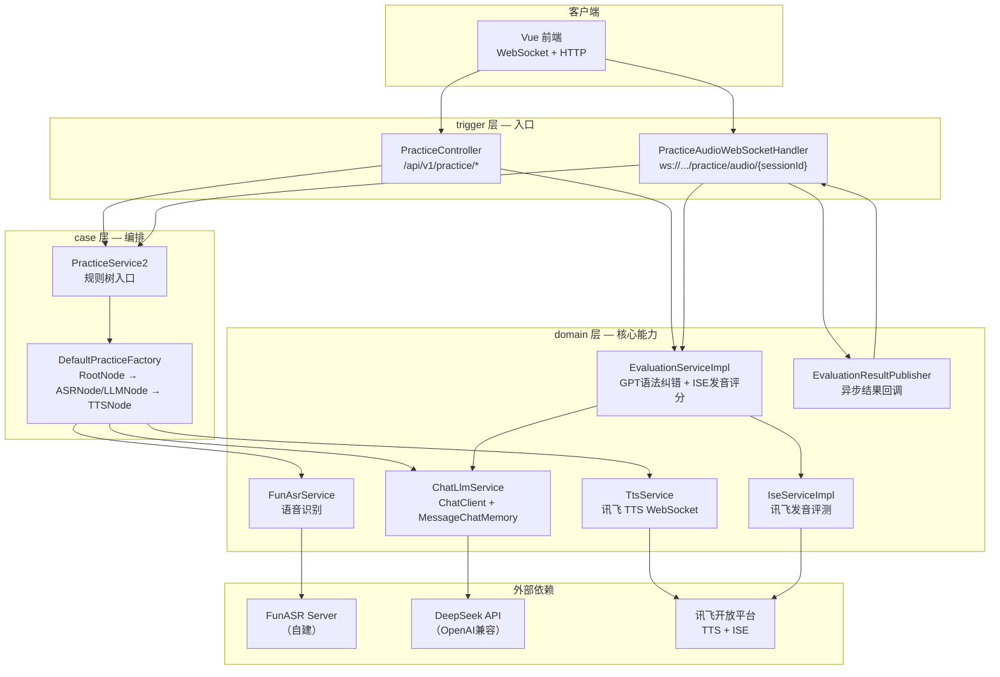

# 口语练习助手 — AI English Practice Companion

基于 Spring AI + 讯飞语音技术构建的智能英语口语练习平台，支持场景化对话、语音识别（ASR）、语音合成（TTS）、语法纠错与发音评测（ISE）。

Domo视频为1.demo.mp4

https://www.bilibili.com/video/BV1ECE86cEKv/?vd_source=6f9af0e33c826e51688d3637b80c4a6a
## 架构总览



## 请求流程

### HTTP 文本输入 — `POST /api/v1/practice/text`

```mermaid
sequenceDiagram
    participant F as 前端
    participant C as PracticeController
    participant S as PracticeService2
    participant T as 规则树
    participant E as EvaluationService
    participant G as DeepSeek/ISE

    F->>C: POST /text { sessionId, text }
    C->>S: handleMessage()
    S->>T: 规则树编排
    T->>T: ASRNode → asrText
    Note over T: LLMNode内异步触发评测
    T->>T: LLMNode → chatBySession() → replyText
    T->>T: → 异步评测（不阻塞TTS）
    T->>T: TTSNode → 合成音频
    T-->>S: PracticeResult
    S-->>C: 返回结果
    Note over C: Controller同步评测（另一次调用）
    C->>E: evaluate() 同步
    E->>G: GPT语法纠错
    E->>G: ISE发音评分
    E-->>C: EvaluationResult
    C-->>F: HTTP响应 { reply, correctedText, score, iseTotalScore... }
    Note over F: 异步评测完成后存入sessionRounds，轮询/report可兜底
```### WebSocket 音频输入 — `ws://.../practice/audio/{sessionId}`

```mermaid
sequenceDiagram
    participant F as 前端
    participant W as WS Handler
    participant T as 规则树
    participant E as EvaluationService
    participant P as Publisher
    participant G as DeepSeek/ISE

    F->>W: 发送PCM音频帧
    F->>W: 发送 "END"
    W->>T: 规则树编排
    T->>T: ASRNode → 语音识别
    T->>T: LLMNode → LLM回复
    Note over T: LLMNode内异步触发评测
    T->>T: TTSNode → 合成音频
    T-->>W: 规则树完成
    W-->>F: WS消息 { asrText, replyText, audioUrl }
    Note over F: 前端保持WS连接，等待异步评测推送

    par 异步评测（LLMNode内触发）
        T->>+E: evaluate() 
        E->>G: GPT语法纠错
        E->>G: ISE发音评测
        E-->>-T: EvaluationResult
        T->>P: publish(sessionId, eval)
        P->>W: callback → sendEvalResult()
        W-->>F: WS消息 { type: "evaluation", correctedText, iseTotalScore... }
    end

    Note over F: 前端收到 type: "evaluation" 后关闭WS，超时(12s)则轮询/report兜底
```## DDD 模块结构

| 模块 | 职责 |
|------|------|
| `*-app` | Spring Boot 启动、配置 |
| `*-trigger` | HTTP 接口、WebSocket 端点 |
| `*-case` | 规则树编排、应用服务 |
| `*-domain` | 领域能力：ASR/TTS/LLM/ISE/Evaluation |
| `*-types` | 通用类型、枚举 |

## 关键节点（规则树）

```
RootNode ── inputType=1 ──→ ASRNode ──→ LLMNode ──→ TTSNode
        └── inputType=2 ──→ LLMNode ──→ TTSNode
```

| 节点 | 功能 |
|------|------|
| RootNode | 根据 inputType 分发 |
| ASRNode | 调用 FunASR 将音频转为文本 |
| LLMNode | 调用 DeepSeek 生成对话回复 + 异步触发语法/发音评测 |
| TTSNode | 调用讯飞 TTS 合成音频 |

## 评测链路

### 语法纠错（GPT）
- 使用专用 `evlChatModel`（DeepSeek），与对话模型分离
- 独立 `evalChatMemory`（MessageWindowChatMemory，10条）
- 输出 JSON：correctedText / grammarIssues / suggestions / score / aiReply

### 发音评测（ISE — iFLYTEK Speech Evaluation）
- 基于讯飞 WebSocket SDK 实时评分
- 四个维度：总分、准确度、流利度、完整度（0-100）
- 异步执行，不阻塞 TTS 合成

## 会话记忆

- 对话使用 `MessageChatMemoryAdvisor` 自动管理历史
- 评测使用独立 ChatMemory，不污染对话上下文
- 对话窗口大小：20条（默认）；评测窗口：10条

## 场景支持

| 场景码 | 说明 |
|--------|------|
| `interview` | 技术面试模拟 |
| `restaurant` | 餐厅点餐 |
| `meeting` | 商务会议 |
| `default` | 日常英语对话 |

---

## API 列表

| 方法 | 路径 | 说明 |
|------|------|------|
| POST | `/api/v1/practice/scenario/{sessionId}/{scenarioCode}` | 注册场景 |
| POST | `/api/v1/practice/text` | 文本对话（含评测结果） |
| POST | `/api/v1/practice/session` | 音频对话（含评测结果） |
| GET  | `/api/v1/practice/session/{sessionId}/report` | 会话报告（含ISE评分） |
| GET  | `/api/v1/practice/session/{sessionId}/export` | 导出会话记录 |
| WS   | `ws://localhost:8091/practice/audio/{sessionId}` | 实时语音对话 |

详细文档见 [doc/FRONTEND-API.md](doc/FRONTEND-API.md)
